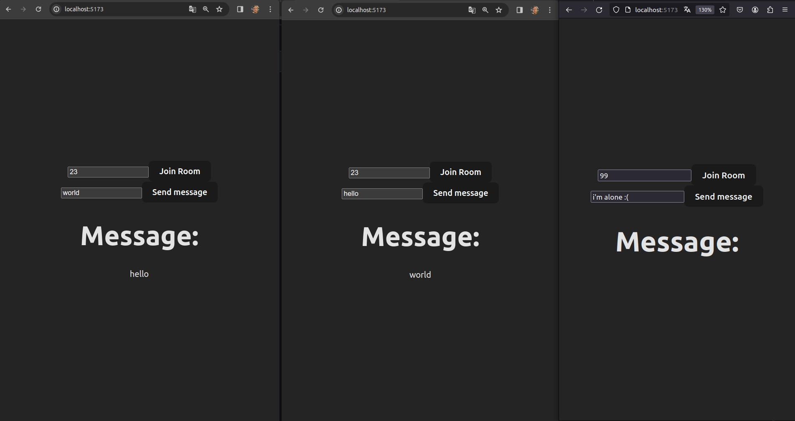

# Socket.io tutorial

## Requisitos

Você deve ter o node e npm instalados. Rode o comando para instalar o npm:

    sudo apt install npm

Instale as dependências no server:

    npm install express cors nodemon socket.io

## Como rodar

O cliente e o servidor devem ser rodados separadamente.

### Servidor

    npm start

### Cliente

    npm run dev

### Exemplo

Após rodar o servidor e o cliente, abra 3 janelas no navegador.
Com 2 janelas você entra na mesma sala, e a outra entra em uma sala diferente.
Você pode perceber que somente janelas na mesma sala podem se comunicar, conforme figura abaixo.

